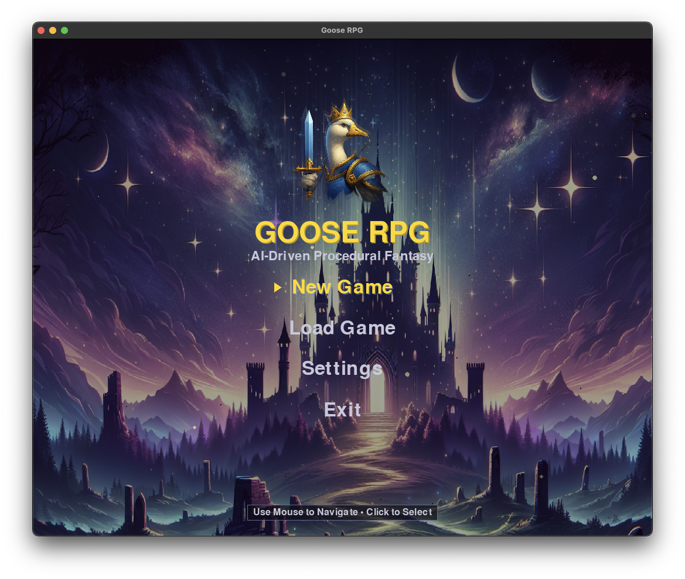

# Goose RPG
## 🤖 **100% AI-Developed Isometric RPG** 

An immersive isometric RPG game featuring combat, exploration, inventory management, and NPC interactions - **entirely created by artificial intelligence** with zero human programming.



### AI Development Team
- **Programming**: Goose AI agent using Claude 4 Sonnet
- **Visual Assets**: Generated by OpenAI's GPT-4 Vision via MCP
- **Music**: Composed by Udio AI
- **Sound Effects**: Sourced as freeware by Claude
- **Human Role**: Creative prompting and direction only

**This demonstrates what AI can accomplish in game development when given creative freedom.**

## Screenshots

### Gameplay
<div align="center">

| In-Game World | Combat System |
|:-------------:|:-------------:|
|  |  |

| Inventory Management | NPC Dialogue |
|:-------------------:|:------------:|
|  |  |

| Trading System | Settings Menu |
|:--------------:|:-------------:|
|  |  |

</div>

## 🎮 Game Features

### Core Gameplay ✅
- **🗺️ Isometric World**: Classic RPG perspective with rich, detailed environments
- **⚔️ Real-time Combat**: Click-to-attack combat system with multiple enemy types
- **🎒 Inventory System**: Collect, manage, and equip weapons, armor, and consumables
- **👥 NPC Interactions**: Talk to shopkeepers, traders, and other characters
- **💾 Save/Load System**: Automatic progress saving with manual save options
- **🎵 Audio Experience**: Atmospheric background music and sound effects
- **🏃 Character Movement**: Smooth point-and-click movement system

### Character Progression
- **📊 Stats System**: Health, mana, experience, and level progression
- **🛡️ Equipment System**: Equip weapons and armor for stat bonuses
- **🏆 Loot Collection**: Discover and collect over 35 different items
- **⚡ Level Advancement**: Gain experience through combat and exploration

### World & Exploration
- **🌍 Large Game World**: Expansive fantasy world with varied terrain
- **🏘️ Multiple Locations**: Villages, forests, dungeons, and wilderness areas
- **👹 Enemy AI**: Intelligent monsters that detect and pursue the player
- **🏪 Trading Posts**: Buy and sell items with various merchants

## 🚀 Installation & Setup

### Prerequisites
- **Python 3.8+** (Python 3.9+ recommended)
- **Git** (for cloning the repository)

### Quick Start
```bash
# Clone the repository
git clone https://github.com/Kvadratni/claude-rpg.git
cd claude-rpg

# Install dependencies using uv (recommended)
uv sync

# Launch the game
./launch_game.sh
```

### Alternative Installation Methods

#### Using uv (Recommended)
```bash
# Install uv if you don't have it
curl -LsSf https://astral.sh/uv/install.sh | sh

# Install dependencies and run
uv sync
uv run claude-rpg
```

#### Using pip
```bash
# Create virtual environment
python -m venv venv
source venv/bin/activate  # On Windows: venv\Scripts\activate

# Install dependencies
pip install -r requirements.txt

# Run the game
python main.py
```

### System Requirements
- **OS**: macOS, Linux, or Windows
- **RAM**: 512MB minimum, 1GB recommended
- **Storage**: 100MB free space
- **Graphics**: Any system capable of running Pygame

## 🎯 How to Play

### Basic Controls
| Action | Control |
|--------|---------|
| **Move Character** | Left Click on destination |
| **Attack Enemy** | Left Click on enemy |
| **Pick Up Items** | Left Click on items |
| **Talk to NPCs** | Left Click on characters |
| **Get Information** | Right Click on anything |
| **Open Inventory** | Press `I` key |
| **Pause/Save Game** | Press `ESC` key |
| **Toggle Fullscreen** | Press `F11` key |

### Getting Started Guide
1. **🎯 Movement**: Left-click anywhere to move your character
2. **🔍 Exploration**: Right-click on objects to learn about them
3. **⚔️ Combat**: Click on enemies to engage in battle
4. **💰 Looting**: Click on items scattered around the world
5. **🎒 Inventory**: Press 'I' to manage items and equipment
6. **💬 NPCs**: Click on characters to start conversations
7. **🛒 Trading**: Visit shops to buy and sell equipment
8. **💾 Saving**: Use ESC menu to save your progress

### Tips for New Players
- **Start by exploring** the immediate area to get familiar with controls
- **Right-click everything** to learn about the game world
- **Collect all items** you find - they can be sold or equipped
- **Talk to NPCs** for hints, trading opportunities, and world lore
- **Save frequently** using the ESC menu

## 🔧 Development Status

### Current State: **Playable Alpha**
- ✅ Core gameplay mechanics implemented
- ✅ Complete UI system with menus and HUD
- ✅ Save/load functionality
- ✅ Audio system with music and effects
- ✅ Comprehensive inventory and equipment system

### Planned Features 🚀
- **🗺️ Procedural Generation**: Dynamic world creation for endless exploration
- **📜 Quest System**: Structured objectives and storylines
- **🔮 Magic System**: Spells and magical abilities
- **🌟 Advanced Skills**: Detailed character progression trees
- **🎭 Rich Storyline**: Main quest with branching narratives
- **⚡ Enhanced Combat**: Special attacks and tactical options

## 🤝 Contributing

This project showcases AI-driven development, but we welcome contributions from the community:

1. **🐛 Bug Reports**: Open an issue describing any problems you encounter
2. **💡 Feature Suggestions**: Share ideas for new game features
3. **🎨 Asset Contributions**: Submit new sprites, sounds, or music
4. **📝 Documentation**: Help improve guides and documentation

## 📄 License

This project is licensed under the MIT License - see the [LICENSE](LICENSE) file for details.

## 🎯 About This Project

Goose RPG serves as a demonstration of what AI can accomplish in game development when given creative freedom. Every line of code, game mechanic, and system was designed and implemented by AI, showcasing the potential for AI-assisted creative projects.

The game is actively developed with new features and improvements added regularly through AI-driven development processes.

---

**🎮 Ready to play? Clone the repo and start your adventure!**

```bash
git clone https://github.com/Kvadratni/claude-rpg.git && cd claude-rpg && ./launch_game.sh
```
EOF 2>&1
