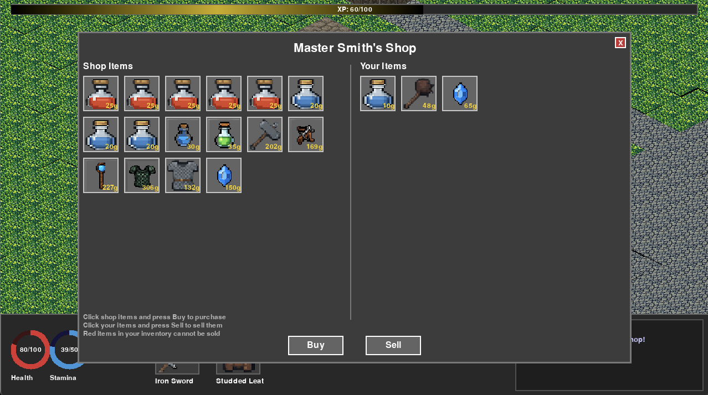
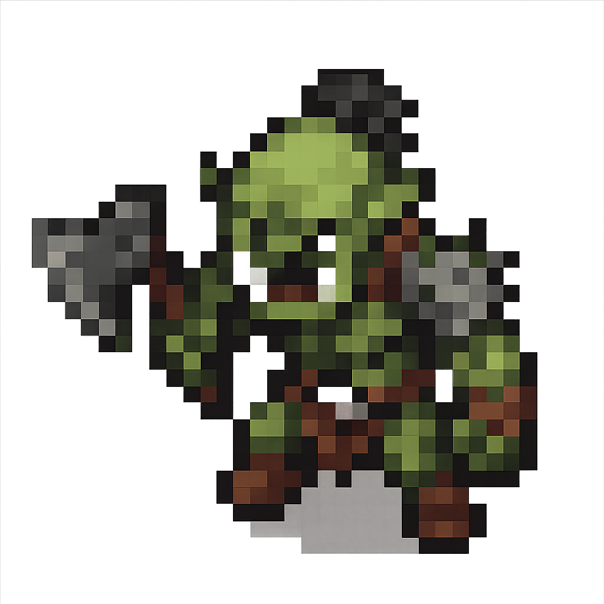
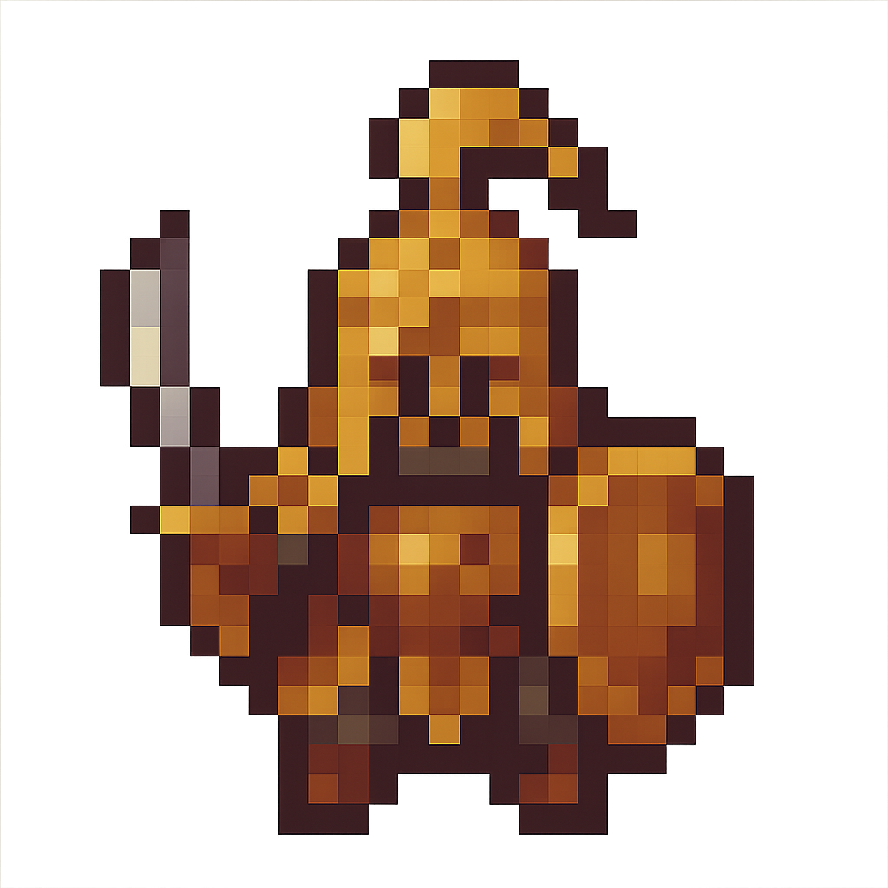
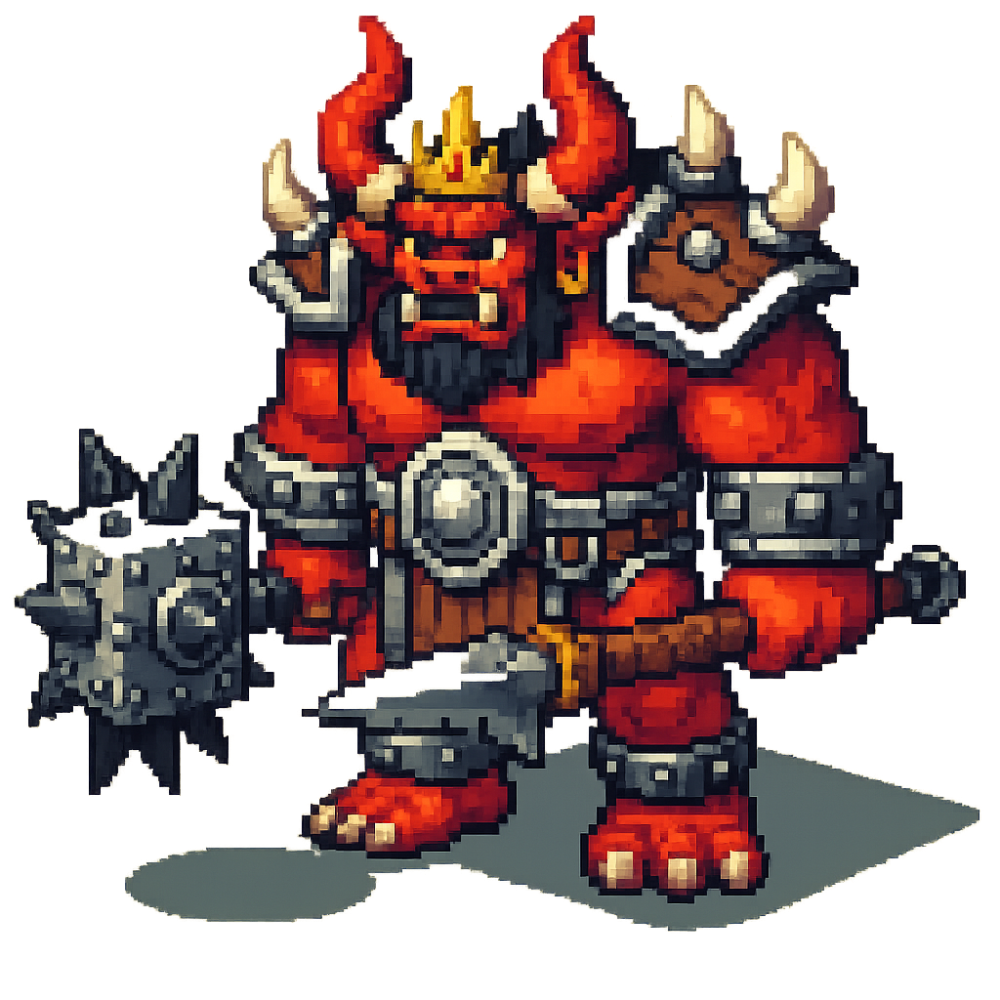

# Goose RPG
## 🤖 **World's First AI-Driven Procedural RPG with Intelligent AI NPCs** 

An immersive isometric RPG game featuring **procedural world generation**, **intelligent AI NPCs**, combat, exploration, and inventory management - **entirely created by artificial intelligence** with zero human programming.


## 🎬 **Game Demo Video**

**Watch the AI NPCs in action!** See how they dynamically create quests, spawn objects in the world, and interact intelligently with players in procedurally generated worlds.

[](https://www.youtube.com/watch?v=i8ziAhtZfOY)

🎥 **[Watch Full Gameplay Demo on YouTube](https://www.youtube.com/watch?v=i8ziAhtZfOY)** - *Click the thumbnail above or this link to watch!*

### AI Development Team
- **Programming**: Goose AI agent using Claude 4 Sonnet
- **Visual Assets**: Generated by OpenAI's GPT-4 Vision via MCP
- **Music**: Composed by Udio AI
- **Sound Effects**: Sourced as freeware by Claude
- **AI NPC System**: Powered by Goose with MCP integration
- **Procedural Generation**: AI-designed infinite world system
- **Human Role**: Creative prompting and direction only

**This demonstrates what AI can accomplish in game development when given creative freedom.**

## Screenshots

### Gameplay
<div align="center">

| In-Game World | Combat System |
|:-------------:|:-------------:|
|  |  |

| Inventory Management | NPC Dialogue |
|:-------------------:|:------------:|
|  |  |

| Trading System | Settings Menu |
|:--------------:|:-------------:|
|  |  |

</div>

## 🎮 Game Features

### 🌍 **Procedural World Generation** ⭐ **NEW!**
- **🗺️ Infinite Worlds**: Each playthrough generates a unique, vast world to explore
- **🏘️ Dynamic Settlements**: Villages, outposts, and trading posts procedurally placed across biomes
- **🌲 Biome Diversity**: Plains, forests, deserts, snow regions, and swamps with unique characteristics
- **🛡️ Settlement Safe Zones**: Large peaceful areas (70-100 tiles) around civilized settlements
- **🎯 Smart Player Spawning**: Players spawn within or near settlements, not in dangerous wilderness
- **🏠 Realistic Population**: Mix of interactive AI NPCs and background population for atmosphere
- **🎲 Seeded Generation**: Reproducible worlds using seed values for consistent experiences

### 🤖 **Revolutionary AI NPC System** ⭐ **NEW!**
- **🧠 Intelligent Conversations**: NPCs powered by advanced AI models (GPT-4, Claude, etc.)
- **📜 Dynamic Quest Generation**: AI NPCs create unique quests on-the-fly based on context
- **🌍 World-Aware NPCs**: Characters understand game state, player progress, and world events
- **🎯 Smart Object Spawning**: Quests automatically spawn items, enemies, and treasures in the world
- **🔄 Adaptive Dialogue**: Conversations change based on player actions and game progression
- **🛠️ Asset-Aware Quests**: AI only uses items and objects that actually exist in the game
- **⚙️ Model Selection**: Choose your preferred AI model (GPT-4, Claude, etc.) in settings
- **🛒 Seamless Tool Integration**: NPCs can open shops, give items, and perform actions while maintaining conversation

### 📋 **Advanced Quest System** ⭐ **NEW!**
- **🎲 Procedural Quests**: AI generates infinite variety of collection, combat, and exploration quests
- **📊 Progress Tracking**: Real-time quest objective tracking with visual indicators
- **🗺️ Directional Spawning**: Quest objects appear in specific directions (North, South, etc.)
- **🎁 Dynamic Rewards**: Context-appropriate rewards based on quest difficulty and type
- **📖 Quest Log**: Comprehensive quest management with active and available quest tracking
- **🔄 Quest Completion**: Automatic reward distribution and progress updates

### 🏹 **Advanced Ranged Combat System** ⭐ **NEW!**
- **🎯 Realistic Projectile Physics**: Arrows, bolts, and magic projectiles travel with realistic trajectories
- **🏹 Diverse Ranged Weapons**: Multiple weapon types with unique characteristics:
  - **Magic Bow** (10.0 range): Longest range magical weapon with golden arrows
  - **Crossbow** (9.0 range): High damage mechanical weapon with heavy bolts
  - **Crystal Staff** (7.0 range): Magical staff shooting crystal shards
  - **Throwing Knife** (6.0 range): Fast, precise thrown weapon
- **⚡ Weapon-Specific Projectiles**: Each weapon fires unique visual projectiles
- **🎵 Dynamic Audio**: Weapon-specific firing sounds and impact effects
- **🎯 Smart Targeting**: Click enemies to attack at proper range automatically
- **⚔️ Range-Based Combat**: Different weapons excel at different combat distances
- **💨 Projectile Speed Variation**: Faster weapons like throwing knives vs. slower magic
- **🔥 Impact Effects**: Visual feedback when projectiles hit targets
- **🛡️ Stamina-Based System**: Each weapon has appropriate stamina costs

### Core Gameplay ✅
- **🗺️ Isometric World**: Classic RPG perspective with rich, detailed environments
- **⚔️ Advanced Combat System**: Real-time combat with both melee and ranged weapons ⭐
- **🏹 Ranged Weapon Mastery**: Master bows, crossbows, and magical ranged weapons ⭐
- **🎒 Inventory System**: Collect, manage, and equip weapons, armor, and consumables
- **👥 NPC Interactions**: Talk to shopkeepers, traders, and other characters
- **💾 Save/Load System**: Automatic progress saving with manual save options
- **🎵 Audio Experience**: Atmospheric background music and sound effects
- **🏃 Character Movement**: Smooth point-and-click movement system

### Character Progression
- **📊 Stats System**: Health, mana, experience, and level progression
- **🛡️ Equipment System**: Equip weapons and armor for stat bonuses
- **🏆 Loot Collection**: Discover and collect over 35 different items
- **⚡ Level Advancement**: Gain experience through combat and exploration

### World & Exploration
- **🌍 Large Game World**: Expansive fantasy world with varied terrain
- **🏘️ Multiple Locations**: Villages, forests, dungeons, and wilderness areas
- **👹 Enemy AI**: Intelligent monsters that detect and pursue the player
- **🏪 Trading Posts**: Buy and sell items with various merchants

## 🚀 Installation & Setup

### Prerequisites

#### Required Software
- **Python 3.8+** (Python 3.9+ recommended)
- **Git** (for cloning the repository)

#### For AI NPC Functionality ⭐ **IMPORTANT**
- **Goose CLI** - Required for AI NPCs to function properly
  - **📖 Installation Guide**: [https://block.github.io/goose/](https://block.github.io/goose/)
  - **🔧 Setup Instructions**: Follow the complete installation and configuration guide
  - **🤖 Model Configuration**: Ensure you have API keys for your preferred AI model (GPT-4, Claude, etc.)
  - **✅ Verification**: Run `goose --version` to confirm installation

> **⚠️ Note**: Without Goose CLI properly installed and configured, AI NPCs will fall back to basic dialogue mode. The revolutionary AI features require a working Goose installation with valid API credentials.

### Quick Start
```bash
# Clone the repository
git clone https://github.com/Kvadratni/claude-rpg.git
cd claude-rpg

# Install dependencies using uv (recommended)
uv sync

# Launch the game
./launch_game.sh
```

### Alternative Installation Methods

#### Using uv (Recommended)
```bash
# Install uv if you don't have it
curl -LsSf https://astral.sh/uv/install.sh | sh

# Install dependencies and run
uv sync
uv run claude-rpg
```

#### Using pip
```bash
# Create virtual environment
python -m venv venv
source venv/bin/activate  # On Windows: venv\Scripts\activate

# Install dependencies
pip install -r requirements.txt

# Run the game
python main.py
```

### System Requirements
- **OS**: macOS, Linux, or Windows
- **RAM**: 1GB minimum, 2GB recommended (for AI processing)
- **Storage**: 200MB free space
- **Graphics**: Any system capable of running Pygame
- **Network**: Internet connection required for AI NPC functionality

## 🎯 How to Play

### Basic Controls
| Action | Control |
|--------|---------|
| **Move Character** | Left Click on destination |
| **Attack Enemy (Melee)** | Left Click on enemy (close range) |
| **Attack Enemy (Ranged)** | Left Click on enemy (any range) ⭐ **NEW!** |
| **Pick Up Items** | Left Click on items |
| **Talk to NPCs** | Left Click on characters |
| **Get Information** | Right Click on anything |
| **Open Inventory** | Press `I` key |
| **Open Quest Log** | Press `Q` key ⭐ **NEW!** |
| **Pause/Save Game** | Press `ESC` key |
| **Toggle Fullscreen** | Press `F11` key |

### Getting Started Guide
1. **🎯 Movement**: Left-click anywhere to move your character
2. **🔍 Exploration**: Right-click on objects to learn about them
3. **⚔️ Combat**: Click on enemies to engage in battle (melee or ranged automatically) ⭐
4. **🏹 Ranged Weapons**: Equip bows, crossbows, or magical weapons for distance combat ⭐
5. **💰 Looting**: Click on items scattered around the world
6. **🎒 Inventory**: Press 'I' to manage items and equipment
7. **💬 NPCs**: Click on characters to start **AI-powered conversations** ⭐
8. **📜 Quests**: Talk to NPCs to receive **dynamically generated quests** ⭐
9. **📖 Quest Log**: Press 'Q' to track your active and available quests ⭐
10. **🛒 Trading**: Visit shops to buy and sell equipment
11. **💾 Saving**: Use ESC menu to save your progress

### Tips for New Players
- **Start by exploring** the immediate area to get familiar with controls
- **Right-click everything** to learn about the game world
- **Talk to every NPC** - they have **unique AI personalities** and may offer quests ⭐
- **Check your Quest Log** (Q key) regularly to track objectives ⭐
- **Follow quest directions** - items and enemies spawn in the world based on quest needs ⭐
- **Collect all items** you find - they can be sold or equipped
- **Try different weapon types** - ranged weapons excel at different combat ranges ⭐
- **Master ranged combat** - bows and crossbows let you fight from safety ⭐
- **Watch your stamina** - ranged weapons consume stamina per shot ⭐
- **Save frequently** using the ESC menu

## 🗡️ **Complete Enemy System** ⭐ **REBALANCED!**

### **🎯 Power Scaling System**
Our revolutionary enemy system features **tier-based spawning** and **biome difficulty scaling** for the perfect challenge progression:

- **📍 Tier-Based Spawning**: Enemy difficulty scales with distance from settlements
  - **Tier 1** (0-30 tiles): Beginner enemies near towns
  - **Tier 2** (30-60 tiles): Intermediate enemies in wilderness  
  - **Tier 3** (60+ tiles): Advanced enemies in remote areas

- **🌍 Biome Difficulty Modifiers**: Each biome has unique challenge levels
  - **🌲 Forest**: 1.0x (Easy/Beginner-friendly)
  - **🌾 Plains**: 1.2x (Medium challenge)
  - **🏜️ Desert**: 1.4x (Hard encounters)
  - **❄️ Snow**: 1.5x (Very hard enemies)
  - **🐸 Swamp**: 1.6x (Extreme difficulty)

- **⚖️ Balanced Spawn Density**: 0.15% of tiles (60 enemies in 200x200 world)

---

### **🌲 Forest Enemies** (Easy Biome - 1.0x Modifier)
*Perfect for new players and early game exploration*

| Sprite | Enemy | Tier | HP | DMG | XP | Type | Notes |
|:------:|-------|:----:|:--:|:---:|:--:|:----:|-------|
|  | **Forest Goblin** | 1-2 | 50-65 | 12-16 | 35-50 | Melee | Forest-dwelling goblin with tribal weapons |
|  | **Forest Sprite** | 1 | 45 | 10 | 30 | Melee | Fast magical forest creature |
|  | **Elder Forest Sprite** | 3 | 70 | 20 | 65 | Melee | Powerful magical forest guardian |
|  | **Goblin Archer** | 2 | 55 | 15 | 45 | Ranged | Bow-wielding forest goblin |
|  | **Skeleton Archer** | 2 | 60 | 18 | 55 | Ranged | Undead archer with bone arrows |
|  | **Ancient Guardian** | 3 | 85 | 22 | 75 | Melee | Skeletal forest protector |
|  | **Goblin Chieftain** | 3 | 95 | 24 | 85 | Melee | Goblin leader with golden crown |

---

### **🌾 Plains Enemies** (Medium Biome - 1.2x Modifier)
*Balanced challenge with orc encounters and bandit raids*

| Sprite | Enemy | Tier | Base HP | Final HP | Base DMG | Final DMG | XP | Type | Notes |
|:------:|-------|:----:|:-------:|:--------:|:--------:|:---------:|:--:|:----:|-------|
|  | **Bandit Scout** | 1 | 50 | 60 | 14 | 17 | 42 | Melee | Quick human outlaw |
|  | **Wild Boar** | 1 | 55 | 66 | 12 | 14 | 36 | Melee | Aggressive plains animal |
|  | **Bandit Raider** | 2 | 70 | 84 | 18 | 22 | 66 | Melee | Armored bandit warrior |
|  | **Orc Scout** | 2 | 75 | 90 | 20 | 24 | 72 | Melee | Light orc reconnaissance |
|  | **Orc Crossbow** | 2 | 80 | 96 | 22 | 26 | 84 | Ranged | Heavy crossbow specialist |
|  | **Orc Warrior** | 3 | 110 | 132 | 28 | 34 | 108 | Melee | Heavily armored orc |
|  | **Bandit Captain** | 3 | 100 | 120 | 26 | 31 | 102 | Melee | Experienced outlaw leader |
|  | **Orc Berserker** | 3 | 120 | 144 | 32 | 38 | 120 | Melee | Rage-fueled orc warrior |

---

### **🏜️ Desert Enemies** (Hard Biome - 1.4x Modifier)
*Dangerous encounters with scorpions, vipers, and dark magic*

| Sprite | Enemy | Tier | Base HP | Final HP | Base DMG | Final DMG | XP | Type | Weapon | Notes |
|:------:|-------|:----:|:-------:|:--------:|:--------:|:---------:|:--:|:----:|:------:|-------|
|  | **Desert Scorpion** | 1 | 60 | 84 | 16 | 22 | 56 | Melee | Stinger | Small but venomous |
|  | **Sand Viper** | 1 | 45 | 63 | 18 | 25 | 63 | Melee | Fangs | Lightning-fast serpent |
|  | **Giant Scorpion** | 2 | 85 | 119 | 24 | 34 | 98 | Melee | Claws | Massive arthropod |
|  | **Desert Nomad** | 2 | 75 | 105 | 22 | 31 | 91 | Ranged | Bow | Robed desert archer |
|  | **Sand Elemental** | 2 | 90 | 126 | 20 | 28 | 105 | Melee | Magic | Swirling sand creature |
|  | **Dark Mage** | 3 | 100 | 140 | 30 | 42 | 154 | Ranged | Dark Magic | Powerful spellcaster |
|  | **Desert Warlord** | 3 | 130 | 182 | 35 | 49 | 168 | Melee | Scimitar | Desert military leader |
|  | **Ancient Scorpion King** | 3 | 140 | 196 | 32 | 45 | 175 | Melee | Crown | Massive scorpion ruler |

---

### **❄️ Snow Enemies** (Very Hard Biome - 1.5x Modifier)
*Extremely challenging with elemental threats and frost magic*

| Sprite | Enemy | Tier | Base HP | Final HP | Base DMG | Final DMG | XP | Type | Weapon | Notes |
|:------:|-------|:----:|:-------:|:--------:|:--------:|:---------:|:--:|:----:|:------:|-------|
|  | **Ice Wolf** | 1 | 55 | 83 | 18 | 27 | 68 | Melee | Fangs | Frost-covered predator |
|  | **Frost Sprite** | 1 | 50 | 75 | 16 | 24 | 60 | Melee | Ice Magic | Hostile ice fairy |
|  | **Ice Troll** | 2 | 95 | 143 | 26 | 39 | 120 | Melee | Ice Club | Large frozen humanoid |
|  | **Crystal Elemental** | 2 | 85 | 128 | 28 | 42 | 128 | Melee | Crystals | Living ice formation |
|  | **Frost Mage** | 2 | 80 | 120 | 30 | 45 | 135 | Ranged | Ice Magic | Ice spellcaster |
|  | **Ancient Guardian** | 3 | 120 | 180 | 35 | 53 | 195 | Melee | Bone Weapons | Powerful undead |
|  | **Frost Giant** | 3 | 160 | 240 | 40 | 60 | 225 | Melee | Ice Hammer | Enormous ice titan |
|  | **Ice Dragon Wyrmling** | 3 | 140 | 210 | 38 | 57 | 210 | Melee | Frost Breath | Young ice dragon |

---

### **🐸 Swamp Enemies** (Extreme Biome - 1.6x Modifier)
*The ultimate challenge with poison, disease, and ancient horrors*

| Sprite | Enemy | Tier | Base HP | Final HP | Base DMG | Final DMG | XP | Type | Weapon | Notes |
|:------:|-------|:----:|:-------:|:--------:|:--------:|:---------:|:--:|:----:|:------:|-------|
|  | **Swamp Rat** | 1 | 50 | 80 | 14 | 22 | 56 | Melee | Disease | Plague-carrying rodent |
|  | **Bog Sprite** | 1 | 55 | 88 | 16 | 26 | 64 | Melee | Swamp Magic | Dark swamp fairy |
|  | **Swamp Troll** | 2 | 100 | 160 | 30 | 48 | 152 | Melee | Club | Moss-covered giant |
|  | **Poison Archer** | 2 | 75 | 120 | 25 | 40 | 128 | Ranged | Poison Bow | Toxic arrow specialist |
|  | **Bog Witch** | 2 | 85 | 136 | 32 | 51 | 160 | Ranged | Dark Magic | Swamp spellcaster |
|  | **Ancient Swamp Lord** | 3 | 150 | 240 | 42 | 67 | 256 | Melee | Vine Crown | Massive swamp ruler |
|  | **Plague Bearer** | 3 | 130 | 208 | 38 | 61 | 232 | Melee | Disease | Rotting plague zombie |
|  | **Swamp Dragon** | 3 | 170 | 272 | 45 | 72 | 288 | Melee | Poison Breath | Moss-covered dragon |

---

### **👑 Boss Enemies** (Ultimate Challenges)
*Biome-specific bosses with massive health pools and devastating attacks*

| Sprite | Boss | Biome | HP | DMG | XP | Special Abilities | Notes |
|:------:|------|:-----:|:--:|:---:|:--:|:---------------:|-------|
|  | **Forest Dragon** | Forest | 600 | 45 | 400 | Nature Magic, Healing | Entry-level boss, forest guardian |
|  | **Orc Warlord** | Plains | 800 | 55 | 500 | Command Aura, Charge | Mid-tier boss, orc commander |
|  | **Desert Lich** | Desert | 900 | 65 | 600 | Dark Magic, Teleport | High-tier undead sorcerer |
|  | **Ancient Dragon** | Snow | 1200 | 75 | 750 | Frost Breath, Ice Storm | Ultimate boss challenge |
|  | **Swamp Hydra** | Swamp | 1000 | 70 | 650 | Multi-Head Attack, Regeneration | Elite multi-headed serpent |

---

### **⚔️ Combat System Features**

#### **🏹 Ranged Combat**
- **Weapon Variety**: 7 different ranged weapon types with unique characteristics
- **Realistic Physics**: Projectiles travel with proper trajectories and speeds
- **Visual Effects**: Each weapon fires distinct projectiles (arrows, bolts, magic)
- **Range Optimization**: Different weapons excel at different combat distances

#### **🤖 Enemy AI**
- **Tier-Based Behavior**: Higher tier enemies have more sophisticated AI
- **Movement Patterns**: Each enemy type has unique movement and attack patterns
- **Ranged Enemy Tactics**: Ranged enemies maintain optimal distance and use cover
- **Boss Mechanics**: Bosses have special abilities and complex attack patterns

#### **📊 Progression System**
- **Smooth Difficulty Curve**: Natural progression from beginner to expert challenges
- **Risk vs Reward**: Venturing into dangerous areas yields better experience and loot
- **Biome Mastery**: Players can choose their preferred challenge level
- **Strategic Depth**: 35+ unique enemy types require different combat approaches

---

### **🎯 Strategy Guide**

#### **For New Players (Forest Biome)**
- Start with **Forest Goblins** and **Forest Sprites** to learn combat basics
- Practice ranged combat with **Goblin Archers**
- Avoid **Tier 3** enemies until you're well-equipped

#### **Intermediate Players (Plains/Desert)**
- **Plains**: Face balanced challenges with **Orc Warriors** and **Bandit Raiders**
- **Desert**: Test your skills against **Giant Scorpions** and **Dark Mages**
- Master both melee and ranged combat for optimal success

#### **Expert Players (Snow/Swamp)**
- **Snow Biome**: Extreme challenges with **Frost Giants** and **Ice Dragons**
- **Swamp Biome**: Ultimate test with **Ancient Swamp Lords** and **Plague Bearers**
- Requires top-tier equipment and advanced combat strategies

#### **Boss Hunting**
- **Forest Dragon**: Perfect first boss for learning boss mechanics
- **Orc Warlord**: Balanced challenge requiring good equipment
- **Desert Lich**: High-tier boss with dangerous magic attacks
- **Ancient Dragon**: Ultimate endgame challenge
- **Swamp Hydra**: Elite boss with unique multi-head mechanics

---

*The enemy system provides infinite replayability with procedural spawning, ensuring every adventure offers fresh challenges and discoveries!*

## 🔧 Development Status

### Current State: **Advanced Beta with Procedural Generation & AI NPCs** ⭐
- ✅ **🌍 Procedural World Generation** - Infinite, unique worlds with biome diversity
- ✅ **🛡️ Settlement Safe Zones** - Large peaceful areas around civilized settlements  
- ✅ **🎯 Smart Player Spawning** - Intelligent spawn placement within settlements
- ✅ **🏠 Realistic Settlements** - Mix of interactive AI NPCs and background population
- ✅ **🤖 Revolutionary AI NPC System** - Dynamic conversations and quest generation
- ✅ **📋 Advanced Quest System** - Procedural quest creation with smart object spawning
- ✅ **🛠️ Asset-Aware AI** - Intelligent item selection that only uses existing game assets
- ✅ **🛒 Seamless Tool Integration** - NPCs can perform actions while maintaining conversation
- ✅ Core gameplay mechanics implemented
- ✅ Complete UI system with menus and HUD
- ✅ Save/load functionality with procedural world support
- ✅ Audio system with music and effects
- ✅ Comprehensive inventory and equipment system

### Recent Major Updates 🚀
- **🌍 Procedural World Generation**: Infinite worlds with diverse biomes and settlements
- **🛡️ Enhanced Settlement System**: Large safe zones and realistic population density
- **🎯 Improved Player Experience**: Smart spawning and better world navigation
- **🤖 AI NPC Integration**: NPCs now powered by advanced language models
- **📜 Dynamic Quest Generation**: Infinite variety of AI-created quests
- **🎯 Smart Object Spawning**: Quests spawn appropriate items and enemies
- **📊 Quest Progress Tracking**: Real-time objective tracking and completion
- **🛠️ Asset Verification System**: AI only uses items that exist in the game
- **⚙️ Model Selection**: Choose your preferred AI model in settings
- **🛒 Tool Integration**: Seamless NPC actions with conversational responses
- **🏹 Advanced Ranged Combat System**: Realistic projectile physics with diverse weapons ⭐ **NEW!**
- **🎯 Weapon-Specific Projectiles**: Unique visual effects for each ranged weapon ⭐ **NEW!**
- **🏠 Building Visibility System**: Advanced occlusion system for building interiors ⭐ **NEW!**
- **⚡ Performance Optimizations**: Massive performance improvements around buildings ⭐ **NEW!**
- **🪑 Furniture System**: Properly scaled furniture with interaction support ⭐ **NEW!**
- **🏹 Ranged Enemy System**: Procedural worlds now properly spawn ranged enemies with diverse weapons ⭐ **FIXED!**

### Planned Features 🚀
- **🗺️ Advanced Procedural Features**: Dungeons, caves, and special locations
- **🔮 Magic System**: Spells and magical abilities
- **🌟 Advanced Skills**: Detailed character progression trees
- **🎭 Rich Storyline**: Main quest with branching narratives
- **⚡ Enhanced Combat**: Special attacks and tactical options
- **🤖 More AI NPCs**: Expand the cast of intelligent characters
- **🌐 Multiplayer Support**: Shared procedural worlds

## 🤝 Contributing

This project showcases AI-driven development, but we welcome contributions from the community:

1. **🐛 Bug Reports**: Open an issue describing any problems you encounter
2. **💡 Feature Suggestions**: Share ideas for new game features
3. **🎨 Asset Contributions**: Submit new sprites, sounds, or music
4. **📝 Documentation**: Help improve guides and documentation

## 📄 License

This project is licensed under the MIT License - see the [LICENSE](LICENSE) file for details.

## 🎯 About This Project

Goose RPG serves as a **groundbreaking demonstration** of what AI can accomplish in game development when given creative freedom. Every line of code, game mechanic, and system was designed and implemented by AI, showcasing the potential for AI-assisted creative projects.

### 🤖 **What Makes This Special**
- **World's First AI-Driven Procedural RPG**: Infinite worlds generated by AI with intelligent NPC integration
- **Revolutionary AI NPC System**: NPCs that think, adapt, and create content dynamically
- **Zero Human Programming**: 100% AI-developed codebase with advanced procedural generation
- **Infinite Content Creation**: AI generates worlds, quests, and interactions in real-time
- **Asset-Aware Intelligence**: AI that understands and works within game constraints
- **Model Flexibility**: Support for multiple AI models (GPT-4, Claude, etc.)
- **Seamless Integration**: Procedural worlds that perfectly integrate with AI NPCs

The game is actively developed with new features and improvements added regularly through AI-driven development processes, pushing the boundaries of what's possible in AI game development.

### 🔬 **Technical Innovation**
- **Procedural World Generation**: AI-designed biome systems with intelligent settlement placement
- **Settlement Safe Zones**: Dynamic peaceful areas that scale with settlement importance
- **Smart Player Spawning**: Context-aware spawn placement within civilized areas
- **MCP Integration**: Model Context Protocol for seamless AI communication
- **Dynamic Object Spawning**: AI creates and places game objects contextually
- **Intelligent Asset Management**: AI verifies and selects appropriate game resources
- **Real-time Quest Generation**: Procedural content creation during gameplay
- **Adaptive Dialogue System**: Context-aware conversations that evolve with gameplay
- **Background Population System**: Realistic settlement atmosphere with mixed NPC types
- **Advanced Ranged Combat Engine**: Real-time projectile physics with weapon-specific behaviors ⭐ **NEW!**
- **Projectile Rendering System**: Dynamic visual effects for arrows, bolts, and magic projectiles ⭐ **NEW!**
- **Advanced Building Occlusion**: Intelligent building visibility system with interior exploration ⭐ **NEW!**
- **Memoized Performance Caching**: Multi-layer caching system for smooth gameplay ⭐ **NEW!**
- **Furniture Integration**: Properly scaled furniture with building template support ⭐ **NEW!**

#### 🏹 **Advanced Ranged Combat System** ⭐ **NEW!**
- **Realistic Projectile Physics**: Projectiles travel from weapon to target with proper trajectories
- **Weapon-Specific Behaviors**: Each ranged weapon has unique range, speed, and projectile type
- **Visual Projectile Rendering**: Real-time rendering of arrows, bolts, magic shards, and thrown weapons
- **Dynamic Audio Integration**: Weapon-specific firing sounds and impact effects
- **Smart Range Detection**: Automatic weapon selection based on target distance
- **Stamina-Based Combat**: Balanced stamina costs prevent ranged weapon spam
- **Impact Effect System**: Visual feedback when projectiles hit enemies or obstacles
- **Multi-Weapon Support**: Seamless switching between melee and ranged combat modes

#### 🏠 **Building Visibility System** ⭐ **NEW!**
- **Smart Occlusion**: Buildings automatically become transparent when player approaches
- **Whole-Building Flattening**: Entire buildings show/hide together for consistent experience
- **Restrictive Proximity**: Only flattens when player is within 1 tile of building edge
- **State Persistence**: Buildings remember their visibility state until player moves
- **Interior Exploration**: NPCs and furniture become visible inside flattened buildings
- **Performance Optimized**: Memoized flood-fill with cached building bounds

#### ⚡ **Performance Optimizations** ⭐ **NEW!**
- **Memoized Building Detection**: Flood-fill calculations cached per building
- **Entity Visibility Caching**: Pre-computed entity visibility states
- **Tile Visibility Caching**: Fast dictionary lookups instead of per-frame calculations
- **Building State Management**: Efficient state tracking with minimal recalculation
- **Optimized Rendering Pipeline**: Eliminated expensive per-frame proximity checks

### 🌟 **Achievements**
- **First AI-Generated Procedural RPG**: Pioneering infinite world generation with AI NPCs
- **Advanced AI Integration**: Seamless tool usage with conversational responses
- **Realistic World Building**: Proper settlement design with safe zones and population
- **Infinite Replayability**: Every playthrough offers unique worlds and experiences
- **Technical Excellence**: Robust save/load system supporting procedural worlds

---

**🎮 Ready to play? Clone the repo and start your adventure!**

```bash
git clone https://github.com/Kvadratni/claude-rpg.git && cd claude-rpg && ./launch_game.sh
```
EOF 2>&1
